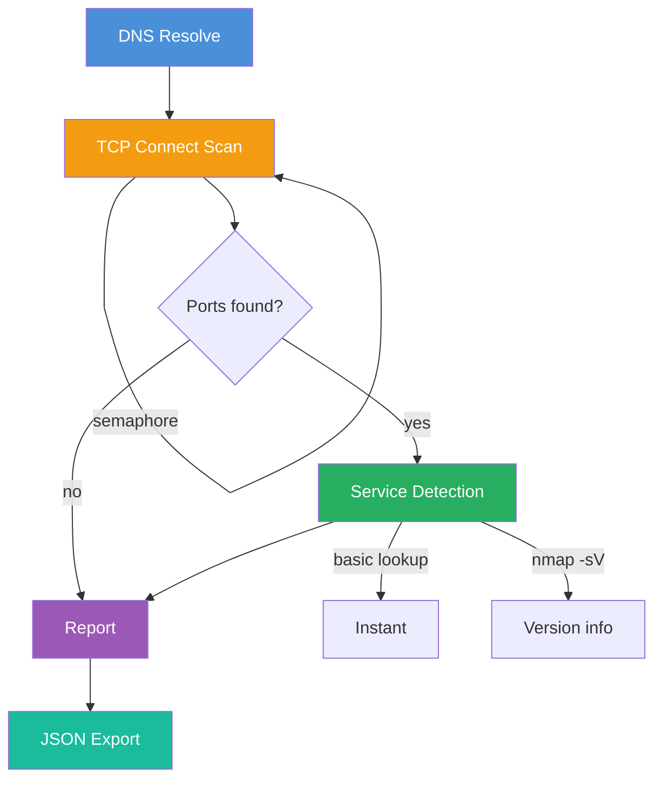

# X3r0Day-Specter

[](https://x3r0day.me)
[](https://python.org)
[](LICENSE.md)
[](https://x3r0day.me)

> Part of the [X3r0Day Project](https://x3r0day.me) | Async TCP port scanner with realtime service detection

```
   _____ ____   ___    __ ______    ___  ____  
  / ___/|    \ /  _]  /  ]      |  /  _]|    \ 
 (   \_ |  o  )  [_  /  /|      | /  [_ |  D  )
  \__  ||   _/    _]/  / |_|  |_||    _]|    / 
  /  \ ||  | |   [_/   \_  |  |  |   [_ |    \ 
  \    ||  | |     \     | |  |  |     ||  .  \
   \___||__| |_____|\____| |__|  |_____||__|\_|
```

## tl;dr

```bash
git clone https://github.com/x3r0day/x3r0day-specter.git
cd x3r0day-specter
pip install rich

# Scan something
python3 main.py scanme.nmap.org

# Specific ports
python3 main.py scanme.nmap.org -p 22,80,443,8080

# Everything
python3 main.py scanme.nmap.org -a
```

## What it does

1. Resolves hostname to IP
2. Fires TCP connect attempts at all the ports you specify
3. Figures out what services are running on open ports
4. Spits out results in a nice terminal UI

## Scan modes

| Mode | Command | When to use |
|------|---------|-------------|
| Top ports | `main.py <target>` | Default, good balance |
| Specific ports | `main.py <target> -p 22,80,443` | When you know what you want |
| All ports | `main.py <target> -a` | Full sweep, takes forever |
| Explicit | `main.py scan <target>` | Backwards compat, same thing |

## Service detection

Basic mode is instant - just looks up the port in a known list. Works well enough for most stuff.

Aggressive mode (`-S`) runs nmap with `-sV -A`. Slower but gives you version info, sometimes CVEs.

## Args

### Positional

| Arg | Type | Description |
|-----|------|-------------|
| `target` | string | One or more hostnames or IPs to scan |

### Optional

#### Port selection

| Short | Long | Type | Default | Description |
|-------|------|------|---------|-------------|
| `-p` | `--ports` | string | - | Specific ports/ranges |
| `-P` | `--top-ports` | int | 1000 | Scan top N most common ports |
| `-a` | `--all-ports` | flag | false | Scan all 65535 TCP ports |

#### Concurrency

| Short | Long | Type | Default | Description |
|-------|------|------|---------|-------------|
| `-c` | `--concurrency` | int | 1000 | Max concurrent TCP connections |
| `-t` | `--timeout` | float | 0.5 | TCP connect timeout in seconds |
| `-C` | `--svc-concurrency` | int | 20 | Concurrent service scans |

#### Service detection

| Short | Long | Type | Default | Description |
|-------|------|------|---------|-------------|
| `-S` | `--aggr-svc-scan` | flag | false | Enable aggressive nmap scan |
| `-M` | `--nmap-args` | string | `-sV -A --open` | Extra args for nmap |
| `-U` | `--sudo-nmap` | flag | false | Run nmap with sudo |
| `-N` | `--no-svc-scan` | flag | false | Skip service detection |

#### Output

| Short | Long | Type | Default | Description |
|-------|------|------|---------|-------------|
| `-o` | `--out` | path | - | Write JSON results to file |

## How it works



### Phase 1: DNS Resolve

- Takes maybe 10ms
- Converts hostname to IP address
- Retries once on failure

### Phase 2: TCP Connect Scan

- Fires async connect() to every port
- Limited by semaphore to avoid flooding
- Tracks progress in realtime

### Phase 3: Service Detection

- Only runs on ports found open
- Basic: instant port-to-service lookup
- Aggressive: runs nmap for version info

### Phase 4: Report

- Renders results in terminal
- Saves JSON if requested

## Examples

```bash
# Basic scan
python3 main.py scanme.nmap.org

# Specific ports, higher concurrency
python3 main.py scanme.nmap.org -p 22,80,443,8080 -c 2000

# Aggressive with sudo
python3 main.py target.com -S -U

# Custom nmap args
python3 main.py target.com -S -M "-sV -sC -O"

# Fast scan, low timeout
python3 main.py 192.168.1.1 -c 2000 -t 0.1

# Conservative for flaky connections
python3 main.py target.com -c 50 -t 5.0

# Multi-target
python3 main.py host1.com host2.com host3.com -P 100

# Save results
python3 main.py target.com -o results.json

# Ports only, no service detection
python3 main.py target.com -a -N
```

## JSON Output

```bash
python3 main.py target.com -o results.json
```

```json
{
  "target": "scanme.nmap.org",
  "ip": "45.33.32.156",
  "req_ports": [1, 2, 3, ...],
  "open_ports": [22, 80, 9929],
  "services": [
    {
      "port": 22,
      "ok": true,
      "state": "open",
      "service": "ssh",
      "info": "OpenSSH 6.6.1",
      "elapsed_sec": 0.023
    }
  ],
  "started": "2026-03-24T10:30:00Z",
  "finished": "2026-03-24T10:30:02Z",
  "elapsed_sec": 2.345,
  "errors": []
}
```

## Requirements

| Dependency | Version | Required |
|------------|---------|----------|
| [Python](https://python.org) | 3.10+ | Yes |
| [Rich](https://github.com/Textualize/rich) | Latest | Yes |
| [Nmap](https://nmap.org) | Any | Aggressive mode only |

```bash
pip install rich
```

## Project structure

```
x3r0day-specter/
├── main.py              # Entry point
├── src/
│   ├── scanner/
│   │   ├── __init__.py
│   │   └── port_scan.py  # Scanner engine + UI
│   └── core/
│       ├── __init__.py
│       └── results.py     # Dataclasses
├── PLAN.md              # Roadmap
└── README.md
```

## Status

This is a tool in active development. Check [PLAN.md](PLAN.md) for what's coming.

## Links

[](https://github.com/x3r0day/x3r0day-specter)
[](https://x3r0day.me)

---

License: See [LICENSE](LICENSE)

Copyright (c) 2026 X3r0Day Team. All rights reserved.
